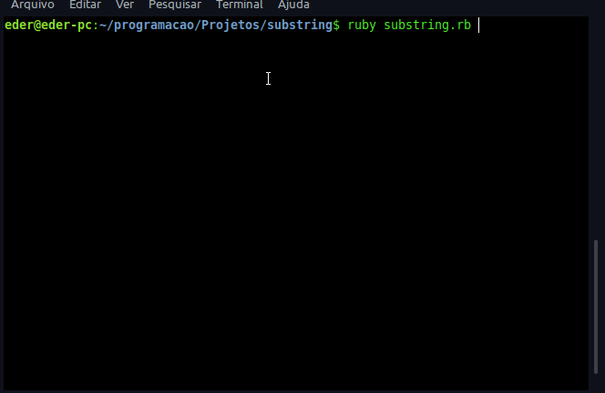

# Sub strings

## Substring is an string inside a string. When there are one or more words in the string. EX: String: Below, Substring: low

    <a href="#author"> 🔎	About the Author</a>

<!--  -->

<h4 align="center">
Project status: ✅ Done
</h4>

### 📝 Features

- [x] Find a substring inside a string when you enter a new word and the number of times that appears.

### 🧐 Demonstration

<h3 align=center>

## 👩🏻‍💻 How to test this application

### ✅Prerequisites

- [x] Linux OS with Rvm installed
- [x] Ruby version 3.3.4 

### 👨🏻‍💻 Testing the web application

- Clone this repository and save in your desktop directory
- Open your linux terminal and navigate to cloned repository
- Inside cloned repo type ruby substring.rb
- Enter a word and type Enter
- See the number of times that a substrings appears

## 🌐 Used Tecnologies

- [HTML5](https://developer.mozilla.org/en-US/docs/Web/HTML)
- [CSS3](https://www.w3.org/Style/CSS/Overview.en.html)
- [Javascript](https://developer.mozilla.org/en-US/docs/Web/JavaScript)

### 🙋‍♂️ Author
---

<a href="https://www.linkedin.com/in/edercirino/">

 

<b>Éder Cirino</b></a>

Made with ❤️ for Éder Cirino 👋 Get in touch

